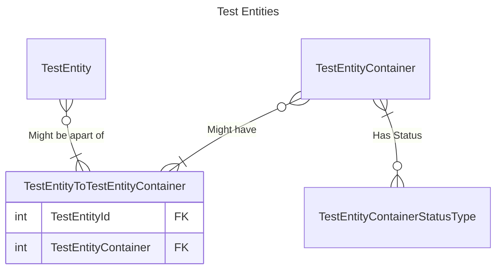

# EF Relationships

QUICK_DESCRIPTION_OF_TOPIC

---

LONGER_MORE_DESCRIPTIVE_DISCUSSION_AROUND_THE_REASON_FOR_THIS_TOPIC

## HOW_TO_DO_SOMETHING
STEPS_ON_HOW_TO_DO_SOMETHING

## HOW_TO_DO_SOMETHING_ELSE
STEPS_ON_HOW_TO_DO_SOMETHING_ELSE
