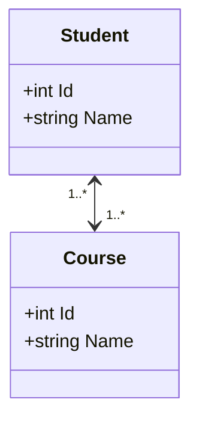
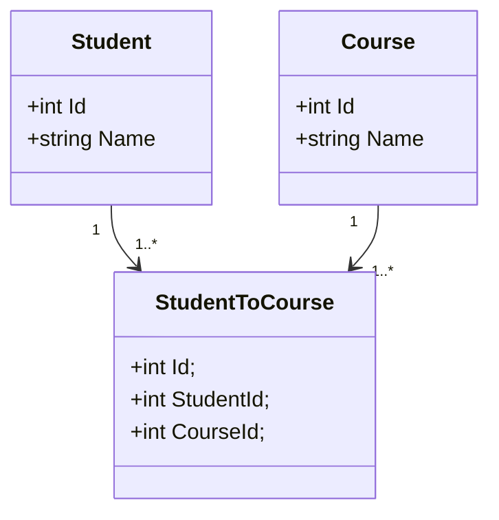
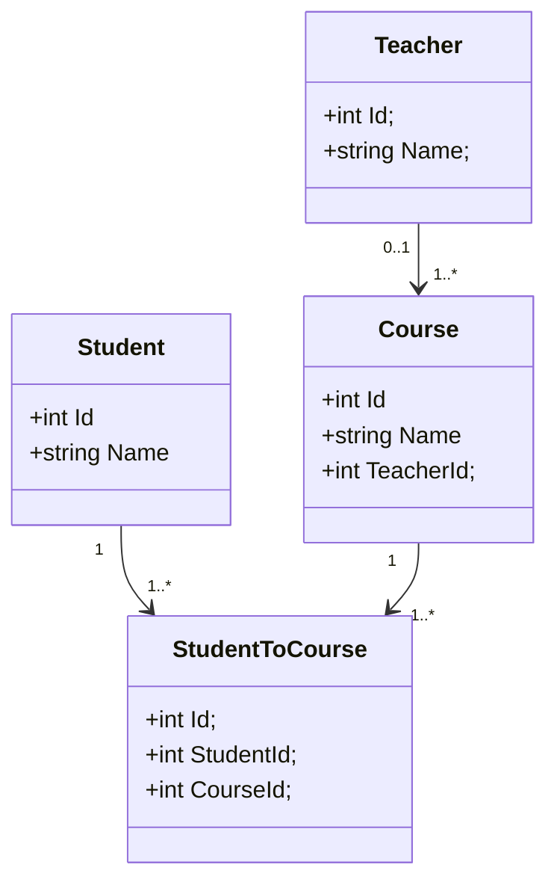

# EF Relationships

Every good relationship relies on good communication.

---

Let's start by discussing a very common example, **Student**, and **Course**.

You'll see this example often, and it is usually something that's easy to understand, and lets
us easily move into many-to-many relationships.
<table>
<tr><th>C# Objects </th><th>Class Diagram</th></tr>
<tr><td>

```csharp
class Student{
    int Id;
    string Name;
}

class Course{
    int Id; 
    string Name;
}
```

</td><td>



</td></tr> </table>

<table>
<tr><th>Students </th><th>Courses</th></tr>
<tr><td>

| Id | Name  |
|----|-------|
| 1  | Adam  |
| 2  | Jimmy |
| 3  | Bimmy |

</td><td>

| Id | Name    |
|----|---------|
| 1  | English |
| 2  | History |
| 3  | Math    |

</td></tr> </table>

---

At this point, we have something that's easy to understand, but
does not represent anything of use.  We have **Students** and **Courses**, which is a start,
but we have no way to represent how those two interact, to do so, let's first define what we really mean with these entities.

>**Adam** is taking **English**
>
>**Jimmy** is taking **Math** and **History**
>
>**Bimmy** is taking **Math**, **History**, and **English**
*<sub>Bimmy is trying too hard.</sub>*

If we consider things from the **Student's** perspective, this looks like a 1-to-many relationship where each student can have many courses.

But switch the perspective, and we see this:
>**English** course's students are **Adam** and **Bimmy**
>
>**History** course's students are **Jimmy** and **Bimmy**
>
>**Math** course's student is  **Bimmy**

Now it looks like it's a 1-to-many again, but this time where each course can have many students.

So now it's obvious, to represent this, we need to introduce a third table, which we will call **StudentToCourse**
This table is often called joining, linking, or briding table, so now let's look at what our diagrams and tables would look like with this new table.

> [!TIP]
> You may note that the name of this new table **StudentToCourse** could have been less esoteric and called **Enrollment**
>
> I caution against this however. It's a better name that more accurately describes the use case,
> but unless you're storing data relevant to the concept of *enrollment* (Like cost) other than just the link between **Student** and **Course**,
> then you'll be asking someone investigating the entities or database tables to play detective and
> surmise that *enrollment* is a linking table.  By keeping the name simple - **StudentToCourse**, it should be immediately obvious what this table is for.

<table>
<tr><th>C# Objects </th><th>Class Diagram</th></tr>
<tr><td>

```csharp
class Student{
    int Id;
    string Name;
}

class Course{
    int Id; 
    string Name;
}
class StudentToCourse{
    int Id; 
    int StudentId;
    int CourseId;
}
```

</td><td>



</td></tr> </table>

<table>
<tr><th>Students </th><th>Courses</th><th>StudentToCourse</th></tr>
<tr><td>

| Id | Name  |
|----|-------|
| 1  | Adam  |
| 2  | Jimmy |
| 3  | Bimmy |

</td><td>

| Id | Name    |
|----|---------|
| 1  | English |
| 2  | History |
| 3  | Math    |

</td><td>

| Id | StudentId | CourseId | StudentName | CourseName |
|----|-----------|---------|-------------|-----------|
| 1  | 1         | 1       | Adam        | English   |
| 2  | 2         | 2       | Jimmy       | History   |
| 3  | 2         | 3       | Jimmy       | Math      |
| 4  | 3         | 1       | Bimmy       | English   |
| 5  | 3         | 2       | Bimmy       | History   |
| 6  | 3         | 3       | Bimmy       | Math      |

</td></tr> </table>

Now we can see that by looking at **StudentToCourse** we can get the relationship described, and this is an example of many-to-many

And for one final step, let's add a small bit of complexity by introduce **Teacher**.
Each course can be taught by one teacher, but one teacher could teach many different Courses, it's even possible that a teacher doesn't teach any courses.
Let's wrap up this by introduce that now now:

>**Mr. Busy** teaches **English** and **History**
>
>**Mr. Plop** teaches **Math**
>
>**Dr. Lazy** teaches nothing.

<table>
<tr><th>C# Objects </th><th>Class Diagram</th></tr>
<tr><td>

```csharp
class Student{
    int Id;
    string Name;
}

class Course{
    int Id; 
    string Name;
    int TeacherId;
}
class StudentToCourse{
    int Id; 
    int StudentId;
    int CourseId;
}
class Teacher{
    int Id;
    string Name;
}
```

</td><td>



</td></tr> </table>

<table>
<tr><th>Students </th><th>Courses</th><th>Teachers</th><th>StudentToCourse</th></tr>
<tr><td>

| Id | Name  |
|----|-------|
| 1  | Adam  |
| 2  | Jimmy |
| 3  | Bimmy |

</td><td>

| Id | Name    |TeacherId|
|----|---------|---------|
| 1  | English | 1       |
| 2  | History | 1       |
| 3  | Math    | 2       |

</td><td>

| Id | Name  |
|----|-------|
| 1  | Mr. Busy  |
| 2  | Mr. Plop |
| 3  | Dr. Lazy|

</td><td>

| Id | StudentId | CourseId | StudentName | CourseName |
|----|-----------|---------|-------------|-----------|
| 1  | 1         | 1       | Adam        | English   |
| 2  | 2         | 2       | Jimmy       | History   |
| 3  | 2         | 3       | Jimmy       | Math      |
| 4  | 3         | 1       | Bimmy       | English   |
| 5  | 3         | 2       | Bimmy       | History   |
| 6  | 3         | 3       | Bimmy       | Math      |

</td></tr> </table>

**AND WITH THAT WE'RE DONE!**
We can now go over to  `/src/tests/Sandbox/EFRelationship` to see how this would all be implemented in actual code.
