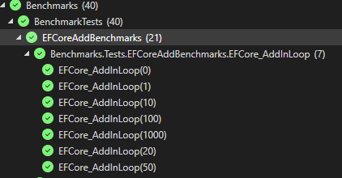
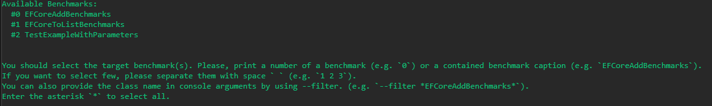

# Benchmark Testing

Don't assume performance, prove it.

---

For benchmark testing, also known as *Performance Testing*, we're using [BenchmarkDotNet](https://benchmarkdotnet.org/).
This is a much better way to test performance over doing comparisons using the [Stopwatch](https://learn.microsoft.com/en-us/dotnet/api/system.diagnostics.stopwatch?view=net-10.0) class.
All of our benchmark tests can be found in `~/tests/Benchmarks/`  

You can find examples of other tests that have been written there in the `/Tests/` folder, along with a template to get started found in `TestExampleWithParameters.cs`

## Why benchmark?

Because you can quickly determine how you should do something. Sometimes speed matters, sometimes memory matters, but without verification,
you'll never know for sure if you're doing something that could be better.

So a real example of this is what lead to the decision to use [ReadOnly Repo with Pagination](xref:KernelInfrastructure.Repositories.ReadOnlyEntityRepo`2)

## Writing a benchmark

When you're ready to write a benchmark, as stated above, take a look at `TestExampleWithParameters.cs` along with already existing examples.

Something to note is that we write these benchmarks to be ran by [BenchmarkDotNet](https://benchmarkdotnet.org/), but to work along side with the [Test Explorer](https://learn.microsoft.com/en-us/visualstudio/test/run-unit-tests-with-test-explorer?view=visualstudio)



While technically optional, I highly recommend you do this to verify your benchmark does what you think it does.

## Running Benchmarks

You can run tests by doing the following:

In a powershell prompt from project folder:

```powershell
cd .\tests\Benchmarks\
.\RunBenchmarkTests.bat
```

After dotnet builds your project in release mode, you'll be greeted with a prompt, asking you to indicate which test(s) you want to run:



After you enter the test you want to run and hit `enter`, the benchmarks will start!

## Analyzing results

Once your benchmarks are finished running, you can take a look in the `BenchmarkDotNet.Artifacts/results` folder, in here you'll find multiple types of output files, like .md, .csv, .html etc.

Any of these are going to show you the final results, but something that I think that makes visualizing the results most meaningful is to use this handy tool someone's developed <https://chartbenchmark.net/>

Once there, you can paste the entire contents of one of the .md result files and view the interactive diagram.

Here's an example using one of the generated test's results:
`Benchmarks.Tests.EFCoreToListBenchmarks-report-github.md`


> [!TIP]
> Based on the results from this benchmark, it became obvious that using

>```cs
>entities.skip().take()
>```

>would have huge memory alloction performance gains, the speed difference looked enormous, but really the amounts are already so small, but that's not true for memory. This is directly what lead to the creation of the ReadOnly repo.
