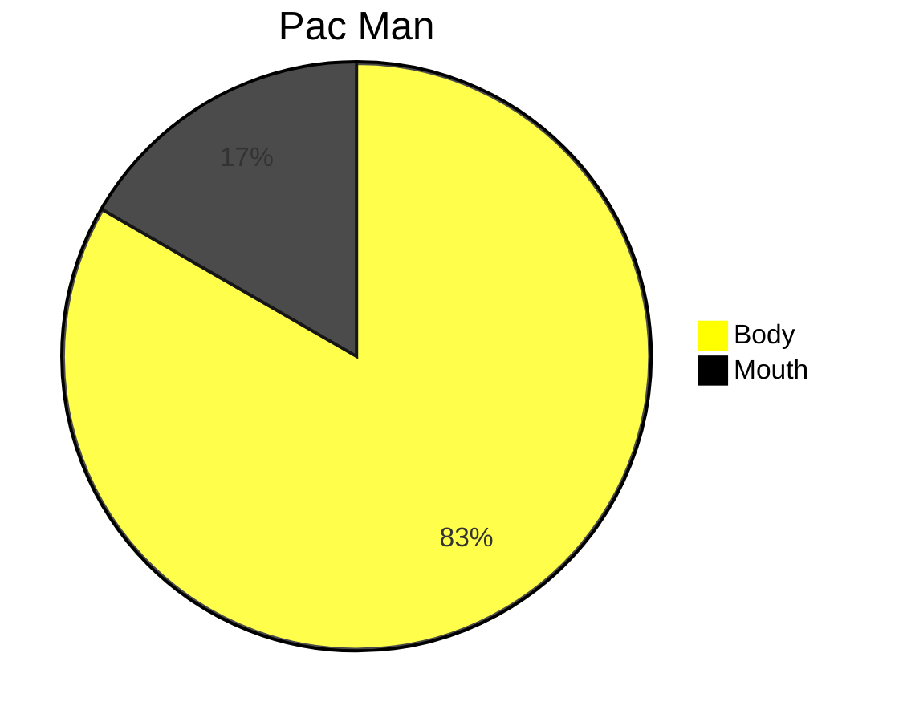
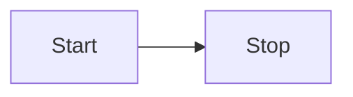

# Document Contribution

If you like reading documentation, you're going to LOVE writing it!

---

## What's the point of documentation?

Documentation takes time to write, it takes time to read, and worst - it takes time to maintain.
That's why we're using [docfx](https://dotnet.github.io/docfx) to auto-generate our code's documentation.
While this particular documentation is geared towards the developers of the application, it would be trivial to extend
this same structure to provide documentation for use for the application's users.

Documentation should exist as a living document, and as such is always open to
modification, anyone is free to propose modifications by using the `Edit this page` button found at the bottom of every documentation file.

There's no real enforcement for writing style, but [Microsoft has some suggestions how to write documentation](https://learn.microsoft.com/en-us/style-guide/global-communications/writing-tips)

**Ultimately documenation is meant to be helpful to read, documentation is not for the writer, it is for the reader.**

## Markdown

Markdown (*.md files) is a standard formatting language and used in nearly every project ever written.

There's lot's of resources on markdown formatting,
like [Markdown Guide](https://www.markdownguide.org/basic-syntax/#overview),
[Github](https://docs.github.com/en/get-started/writing-on-github/getting-started-with-writing-and-formatting-on-github/basic-writing-and-formatting-syntax)
also a [Markdown Cheatsheet](../../templates/markdown-cheatsheet.md)

The complications of Markdown comes from knowning what's supported, and what's not, as it depends what you're using to view the .md file.
For the most part, all markdown renderers support features that Github does, so if it works on Github, it probably works on your renderer.
For example, language syntax highlighting [here's what GitHub does](https://docs.github.com/en/get-started/writing-on-github/working-with-advanced-formatting/creating-and-highlighting-code-blocks#syntax-highlighting)

`docfx` uses [Markdown](https://dotnet.github.io/docfx/docs/markdown.html?tabs=linux%2Cdotnet) rendered with [Markdig](https://github.com/xoofx/markdig)

And that's not all!  You can even render diagrams using [Mermaid](https://mermaid.ai/open-source/syntax/flowchart.html)
like this:



Docfx translates our .md files into HTML, but you can read them just fine on your computer as well, and even within visual studio using an [extension](https://marketplace.visualstudio.com/items?itemName=MadsKristensen.MarkdownEditor2).

## Why use .md for documentation?

Because the alternative is something like .docx, or .pdf.  Both absolutely could work,
but they are inherently difficult to maintain history and aren't very condusive to source control.

This matters because documentation *should* be relevant to your project, and your project is in source control.
So as your project changes, so too should your documentation.  

## What does Docfx do?

This documentation is generated through [docfx](https://dotnet.github.io/docfx)

While markdown files are essential to actually creating the documention, Docfx is responsible for bundling all of it up
into one static site that can be hosted easily.

*like this one...*

In addition, it also automatically parses through your code, and generates documentation for it as well.

If we only needed documentation without generation, then [Mkdocs](https://www.mkdocs.org/) would probably be better.

## How do I add documentation?

If you need to add code documentation, or the stuff found in [API](/generated/api/Api.html) then nothing! That's all automagic. <!-- markdownlint-disable-line MD061 -->

For everything else, you'll want to follow the structure of how everything else is written, which is generally this:

```xaml
📂assets                 
  📂root                 
    📂docfx              
        📂images         
        📂build      //Files to build the static doc site
        📂articles   
            📂guides
                📄toc.yml //This tells the site where to find .md files
                📄overview.md    //Overview for the section
                📄documentation-contribution.md  //You are here!
            ...
        📂generated //Generated API stuff. 
        📂templates //Templates where you can find example .md files
    
```

So if you wanted to your own guide, follow these steps:

1. Copy `~docfx/templates/document-template.md`
2. Paste the copied document into the `~docfx/articles/guides/` directory
3. Rename the file to whatever you want, EX: `my-guide.md`
4. Fill that file with whatever content you want.
5. Edit `~docfx/articles/guides/toc.yml` to this:
    ```yaml
    - name: Overview
      href: overview.md
    - name: Contributing to documentation
      href: documentation-contribution.md
    - name: My Guide    #This is the name in the sidebar.
      href: my-guide.md #This is the file name to be linked to.
    ```

**And that's it!**

But you should probably check your work, to do so, you can execute the build batch file to generate and run a local version of the site.
> [!IMPORTANT]
> [Node.js](https://nodejs.org/) is required to run the local version.
>
> Also pay attention to the warnings issued from the build and correct what is reported. (If it's something you actually adjust yourself)

In a powershell prompt from project folder:

```powershell
cd .\assets\Assets\root\docfx\build\
.\GenerateAndRunLocalDocumentation.bat
```

This batch file will install the required tools to build this documentation, then hosts it on [http://localhost:8080]("http://localhost:8080")

## Markdown Features

Besides the [basic features](https://www.markdownguide.org/basic-syntax/#overview) of markdown, here's a few quick examples of more advanced things you can do.

> [!TIP]
> Don't forget to check out the [Markdown Cheatsheet](../../templates/markdown-cheatsheet.md)
>
> [docfx](https://dotnet.github.io/docfx/docs/markdown.html?tabs=linux%2Cdotnet#markdown-extensions) has some additional extensions included to further enrich documentation.

### Diagrams and Charts

You can use [Mermaid](https://mermaid.js.org/) to generate diagrams and charts.

**Example Markdown:**

````markdown

````

**Rendered Output:**


### Tables

You can create [tables](https://www.markdownguide.org/extended-syntax/#tables), using pipe syntax.

**Example Markdown:**

````markdown
| First Header  | Second Header |
| ------------- | ------------- |
| Content Cell  | Content Cell  |
| Content Cell  | Content Cell  |
````

**Rendered Output:**

| First Header  | Second Header |
| ------------- | ------------- |
| Content Cell  | Content Cell  |
| Content Cell  | Content Cell  |

### Code Snippets

You can render [code snippets](https://www.markdownguide.org/extended-syntax/#syntax-highlighting) which can be highlighted using [defined language identifiers](https://github.com/github-linguist/linguist/blob/main/lib/linguist/languages.yml)

**Example Markdown:**

````markdown
```ts
//Typescript Hello World!
let message: string = 'Hello, World!';
console.log(message);
```
````

**Rendered Output:**

```ts
//Typescript Hello World!
let message: string = 'Hello, World!';
console.log(message);
```

### Alerts

Alerts are block quotes that render with colors and icons that indicate the significance of the content.

**Example Markdown:**

````markdown
> [!NOTE]
> Information the user should notice even if skimming.

> [!TIP]
> Optional information to help a user be more successful.

> [!IMPORTANT]
> Essential information required for user success.

> [!CAUTION]
> Negative potential consequences of an action.

> [!WARNING]
> Dangerous certain consequences of an action.
````

**Rendered Output:**
> [!NOTE]
> Information the user should notice even if skimming.

> [!TIP]
> Optional information to help a user be more successful.

> [!IMPORTANT]
> Essential information required for user success.

> [!CAUTION]
> Negative potential consequences of an action.

> [!WARNING]
> Dangerous certain consequences of an action.

### Emoji

You can use [emoji short codes](https://github.com/ikatyang/emoji-cheat-sheet/blob/github-actions-auto-update/README.md) or copy and pasting [unicode](https://unicode.org/emoji/charts/full-emoji-list.html)

> [!NOTE]
>Deciding between short code or unicode really depends on the emoji you need.  If you can use a short code, you probably should.
>
>If you see a [] in your text editor, it's because it's unicode.
>In the below example,  the 'melting face' is unicode U+1FAE0

**Example Markdown:**

````markdown
Unicode - 🫠 😀 😍

Short Code - :melting_face: :grinning: :heart_eyes:
````

**Rendered Output:**

Unicode - 🫠 😀 :heart_eyes:

Short Code - :melting_face: :grinning: :heart_eyes:
