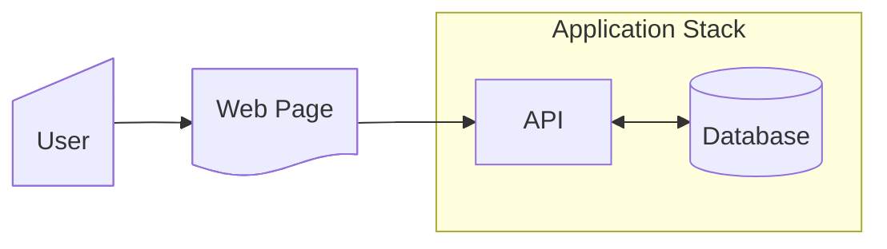
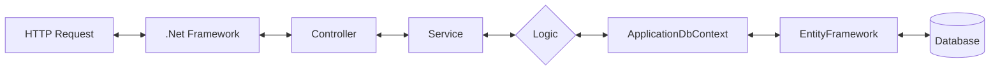
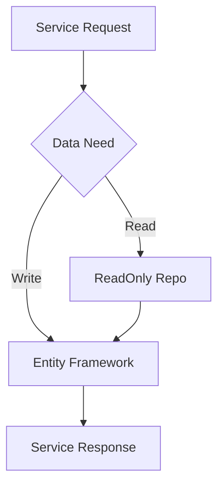

# How to fetch data from the database

Because I've never heard of a write-only database.

---

## High Level Concept

There's multiple ways to fetch data from the database, but unless you're in a really specific and
uncommon situation, there's only a handful of ways you should.  From a very high-level view,
data is going to flow through the application to the user like this:



You probably already knew this, let's expand the `Application Stack` architecture



And finally, if we expand on `Logic` from the above



It's at this point we can see that service requests that fetch data should rely on the [ReadOnly Repo](xref:KernelInfrastructure.Repositories.ReadOnlyEntityRepo`2). <!-- markdownlint-disable-line MD061 -->
>[!NOTE]
>Accessing data through Entity Framework is not forbidden, but unless the `ReadOnly Repo` cannot be used, the use of fetching data through it should be discouraged.

## Why use ReadOnlyRepo?

**`ReadOnly Repo` is going to feel more irritating to use than Entity Framework, because it's always going to be asking you to limit your request of 'all the data'.  That's very intentional.**

There's a benchmark test called `EFCoreToListBenchmarks.cs` that shows the performance between the different ways you can 'get data'.
>[!tip]
>You can learn more about how this was generated in the guide - [Benchmark Testing](benchmark-testing.md)

Here's a quick excerpt of those results, using 1000 records, and 'taking' 50 of them:

| Fetch Type                      | Records taken | Time       | Allocated Memory |
|---------------------------------|---------------|------------|------------------|
| EFCore_NoTake                   | 100           | 2,198.3 us | 1664.32 KB       |
| EFCore_WithTake                 | 50            | 400.3 us   | 161.32 KB        |
| EFCore_WithTake_AndAsNoTracking | 50            | 374.5 us   | 127.63 KB        |

These results shows us a few things:

1) It's faster to fetch a subset of data (in this case, 50 records) than to take all of them.
2) It takes less memory to take a smaller subset of data.
3) Including 'AsNoTracking' in our query in both speed and memory allocation is better on the whole, the only downside is you'd have to reattach the entity for changes to be commited to the DB.

This is obvious of course, naturally taking a subset of data will yield better performance,
and that's what this repo seeks to guide you to do.
By being opinionated about always asking you to consider how much data you're returning, you never have the chance to forget including pagination as part of your result set.
And by working around the `ReadOnly Repo` you're never really in fear of forgetting to use the pagination features, which could lead to the `EFCore_NoTake` example above.

**You won't notice an issue at first, but at some point, your application is going to perform worse without it.**

However, it is not always possible to paginate, and that's why you can use `GetEntityQueryable()` which at least comes with the small `.AsNoTracking()` benefit.

## When you SHOULD use pagination

**Any time you're returning data to the client.**

Because the client side should never recieve the entire table's worth of data. (Unless of course you have a very, VERY small table)
This covers...Almost every possible example, but not all.

>[!NOTE]
>Pagination **ALWAYS** requires ordering.  If you don't care about the order, just use the PK - ID.

>Example:
>
>You need to get all users who are in a status of pending, and return them to the client

You can fetch and paginate using either the DB context, or the ReadOnly repo:

### [ReadOnlyRepo](#tab/ReadOnlyRepo)

```csharp
readonlyRepo<User>.GetPaginatedEntityAscendingAsync(2, 10, order: o => o.Id, where: p.Status == pending);
```

### [DbContext](#tab/DbContext)

```csharp
dbContext.Users.Where(p => p.Status == pending).OrderBy(o => o.Id).Skip(10).Take(10).ToList();
```

---

## When you CANNOT use pagination

Any time you MUST iterate over all the data.
>Example:
>
>You need to get all users who are in a status of pending, and send them an email:

### [ReadOnlyRepo](#tab/ReadOnlyRepo) <!-- markdownlint-disable-line MD024 MD051 -->

```csharp
emailService.EmailUserAboutStatus(readonlyRepo<User>.GetEntityQueryable().Where(p.Status == pending).ToList())
```

### [DbContext](#tab/DbContext)

```csharp
emailService.EmailUserAboutStatus(dbContext.Users.Where(p.Status == pending).ToList())
```

---

## What if the requirement makes pagination not possible?

Let's slightly complicate the above example by expanding on what the use-case probably would be
>Example:
>
>You need to get all users who are in a status of pending, and send them an email
>
>**THEN** return back to the client a list of all the users who you've just sent emails to.

So right off the bat this is a strange one, because once this is done, can you ever get the response again?
If the client that issued the request loses internet, do they just...Never get the chance to see what happened?
The above requirement makes pagination *technically* possible, but *practically* not.

We can see we already need to adjust the use-case, because of the above.  Updating, we'd now say:

>Example:
>
>You need to get all users who are in a status of pending, and send them an email
>
>***THEN** update a UserToEmail table indicating this email has been sent.*
>
>**THEN** return back to the client a list of all the users who you've just sent emails to.

With this addition of requirements, we're able to now compose our code to accomodate this request.
By creating an endpoint that makes a request to perform this email function, we can also provide an endpoint that will paginate results from the `UserToEmail` table
without the need of re-sending emails in order to get the results.

Of course the modification of the requirements could have happened without the `ReadOnly Repo` and still have access the `DbContext` directly, the key
difference is that once we've started considering our output back to the client, it becomes clear that pagination as a data fetching
concept is something that we can consider from the onset, and design to - rather, than around.

## TL;DR

With every time you access data from the `DbContext`, always consider where it's going, and if that is going to end up on the client, then there's likely no compelling reason to not use the `ReadOnly Repo`.

## Additional Resources

### Documentation

- [How To Insert Data](how-to-insert-data-db.md)
- [Ef Relationships](../concepts/ef-relationships.md)
- [Benchmark Testing](benchmark-testing.md)
- [ReadOnly Repo](xref:KernelInfrastructure.Repositories.ReadOnlyEntityRepo`2) <!-- markdownlint-disable-line MD061 -->

### Code Examples

- `\tests\Sandbox\Concept Demos\HowDoIGetData\HowDoIGetData.cs`
- `\tests\Sandbox\Concept Demos\EFRelationship\EFRelationship.cs`
- `\tests\Sandbox\Concept Demos\HowDoIAddData\HowDoIAddData.cs`
- `\tests\KernelTests\Kernel.Integration.Tests\RepositoryTests\ReadOnlyEntityRepoTests.cs`
- `\tests\KernelTests\Kernel.Infrastructure.Unit.Tests\ExtensionTests\PaginationExtensionTests.cs`
