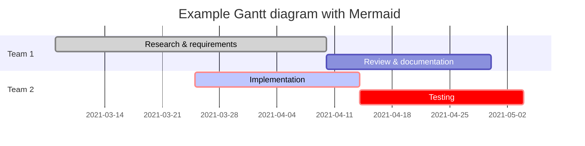

# This is the **HOMEPAGE**.


> [!TIP]
> Here's a tip.


Refer to [Markdown](http://daringfireball.net/projects/markdown/) for how to write markdown files.

## Quick Start Notes:

1. Add images to the *images* folder if the file is referencing an image.


> [!NOTE]
> Information the user should notice even if skimming.

> [!TIP]
> Optional information to help a user be more successful.

> [!IMPORTANT]
> Essential information required for user success.

> [!CAUTION]
> Negative potential consequences of an action.

> [!WARNING]
> Dangerous certain consequences of an action.
To get started with the setup of this website, read the getting started document with the title [Using DocFx and Companion Tools](./general/getting-started/README.md).

## Style of this website

This documentation website is currently setup with the basics of the [DocFx Material](https://ovasquez.github.io/docfx-material/) style added with the Microsoft logo. The combination can be found in **/QuickStart/docfx/template**. In the template we also enabled diagram support through [Mermaid](https://mermaid.js.org).

```csharp
using System;

namespace HelloWorld
{
    class Program
    {
        static void Main(string[] args)
        {
            Console.WriteLine("Hello World!");
        }
    }
}
```

## Mermaid support

To enable the rendering of [Mermaid](https://mermaid-js.github.io/mermaid/#/) diagrams in the documentation website, the code below can be added to **partials\scripts.tmpl.partial**.

```html
<!-- Support for diagrams (Mermaid). See https://mermaid.js.org/intro/n00b-gettingStarted.html -->
<script type="module">
    import mermaid from 'https://cdn.jsdelivr.net/npm/mermaid@10/dist/mermaid.esm.min.mjs';
    mermaid.initialize({ startOnLoad: true });
</script>
```

By adding this, mermaid diagrams are rendered in the website.

A sample Mermaid diagram could be something like:

<!-- markdownlint-disable MD040 -->
````
gantt
 title Example Gantt diagram with Mermaid
    dateFormat  YYYY-MM-DD
    section Team 1
    Research & requirements :done, a1, 2021-03-08, 2021-04-10
    Review & documentation : after a1, 20d
    section Team 2
    Implementation      :crit, active, 2021-03-25  , 20d
    Testing      :crit, 20d
````
<!-- markdownlint-enable MD040 -->

which will be rendered as:



## 'Copy code'-button

It can be desirable to have a copy button on code blocks to copy the contents to the clipboard for easy re-use. We have added this solution to the template for the website. In the **Styles** folder two files were added: **copyCodeButton.css** and **copyCodeButton.js**. In **partials\scripts.tmpl.partial** the JavaScript file is referenced:

```html
...
<script type="text/javascript" src="{{_rel}}styles/copy-code-button.js"></script>
...
```

And in **partials\head.tmpl.partial** the CSS file is referenced:

```html
...
  <link rel="stylesheet" href="{{_rel}}styles/copy-code-button.css">
...
```

When this is added, code blocks will have a Copy-button like this:


When a user clicks the Copy-button, the contents is copied into the clipboard and the icon changes for some time to indicate the copy was succesfull:


